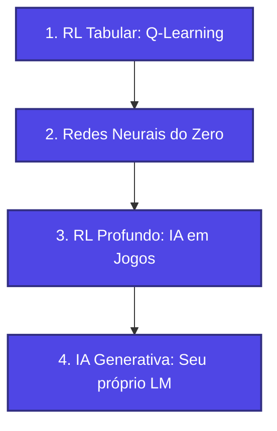

Se a Inteligência Artificial (IA) é o objetivo final, por que o mercado e a academia usam tantos termos diferentes? 

Longe de ser apenas marketing, essa divisão reflete a evolução histórica e técnica da computação. Cada termo representa uma abordagem que surgiu para superar as limitações da geração anterior.

---

### ⏳ O Cenário Pré-IA: O que tínhamos antes?

Antes de o termo "Inteligência Artificial" ser cunhado em **1956**, a ciência computacional usava outras nomenclaturas:

*   **Cibernética:** Termo proposto pelo matemático Norbert Wiener em **1948** para estudar o controle e a comunicação entre animais e máquinas.
*   **Teoria dos Autômatos:** O estudo matemático de como sistemas de regras lógicas processam entradas e saídas.
*   **Inteligência de Máquina (*Machine Intelligence*):** O termo preferido pelo matemático Alan Turing em seu artigo de **1950**.

A simulação do intelecto era vista como uma extensão direta da lógica matemática e dos circuitos elétricos, até que John McCarthy batizou a área formalmente no simpósio do Dartmouth College.

---

### 📦 A Relação de Contenção (Taxonomia)

Para não se perder na sopa de letras, imagine essas áreas como bonecas russas (*matrioscas*), onde cada uma cabe dentro da outra:

*   **Inteligência Artificial (IA):** O campo mais amplo. Engloba qualquer técnica que simule o comportamento inteligente humano (seja por regras rígidas ou aprendizado).
*   **Aprendizado de Máquina (ML - *Machine Learning*):** Subconjunto da IA. Algoritmos que aprendem padrões a partir de dados, sem programação manual rígida.
*   **Aprendizado Profundo (DL - *Deep Learning*):** Subconjunto do ML. Utiliza redes neurais artificiais multicamadas (profundas) para extrair padrões complexos.
*   **IA Generativa (*Generative AI*):** Subconjunto do DL focado em **criar** novos dados (textos, imagens, áudios) baseando-se no aprendizado anterior, em vez de apenas classificar informações.

---

### ⚙️ Os Três Pilares do Aprendizado de Máquina (ML)

Para ensinar uma máquina, precisamos de uma metodologia. O Aprendizado de Máquina é tradicionalmente estruturado em três métodos:

#### 1. Aprendizado Supervisionado (*Supervised Learning*)
*   **Conceito:** A máquina aprende a partir de dados rotulados (com "perguntas e respostas" já fornecidas para calibração).
*   **Exemplo prático:** Ensinar um classificador a identificar se um e-mail é spam mostrando milhares de exemplos marcados manualmente como "spam" ou "não-spam".
*   **🧬 Conexão com nossa trilha:** Você usará esse método ao construir sua primeira **Rede Neural**! Ensinaremos a rede a calibrar seus pesos matemáticos comparando suas previsões com gabaritos reais de treinamento.

#### 2. Aprendizado Não Supervisionado (*Unsupervised Learning*)
*   **Conceito:** A máquina recebe dados brutos sem qualquer rótulo ou gabarito e precisa descobrir agrupamentos, semelhanças e estruturas ocultas sozinha.
*   **Exemplo prático:** Segmentar clientes de um aplicativo em diferentes perfis de comportamento para direcionar campanhas de marketing automatizadas.
*   **🧬 Conexão com nossa trilha:** Como o nosso foco está em tomada de decisão ativa (agentes/jogos) e geração, o método não supervisionado será tratado prioritariamente em nível conceitual e teórico.

#### 3. Aprendizado por Reforço (RL - *Reinforcement Learning*)
*   **Conceito:** O agente aprende interagindo com um ambiente dinâmico por meio de tentativa e erro, recebendo "recompensas" para ações desejadas e "punições" para erros.
*   **Exemplo prático:** Um robô aprendendo a equilibrar um poste ou desviar de obstáculos físicos.
*   **🧬 Conexão com nossa trilha:** **Este é o pilar que estudaremos a fundo nas próximas fases!** Você construirá um algoritmo clássico de RL chamado **Q-Learning** para guiar um personagem virtual a escapar de um labirinto.

---

### 🧠 O Salto do Aprendizado Profundo (DL)

O Aprendizado Profundo surgiu para resolver o maior gargalo do ML clássico: a necessidade de extração manual de características (*feature engineering*). Em ML tradicional, um engenheiro humano precisa escolher quais variáveis o algoritmo deve analisar (como medir o diâmetro de uma placa de trânsito).

> **A Solução do DL:**
> As **Redes Neurais Artificiais Profundas** fazem isso de forma automática. Ao empilhar dezenas de camadas de neurônios, as primeiras detectam padrões simples (como linhas e bordas) e as últimas combinam tudo para entender conceitos abstratos (como rostos ou placas inteiras).

---

### ✨ E onde entra a IA Generativa?

A IA Generativa representa o ápice atual das capacidades do Deep Learning. Ela inverte o paradigma clássico dos modelos:

*   **Modelo Discriminativo (ML/DL clássico):** Analisa dados existentes e decide. 
    *   *Exemplo:* Analisa o sentimento de uma mensagem e diz se ela é raivosa ou amigável.
*   **Modelo Generativo (IA Generativa):** Cria dados sintéticos novos a partir de um comando (*prompt*).
    *   *Exemplo:* Escreve uma resposta de e-mail completa, empática e gramaticalmente correta.

Para isso, a IA Generativa usa arquiteturas profundas altamente complexas, como os **Transformers** (base do GPT e Claude) e as **GANs** (Redes Adversariais Generativas).

---

### 🗺️ O Nosso Caminho Prático de Aprendizado

Nossa trilha pedagógica foi planejada para levar você da teoria ao código de forma **gradual e empírica**:

1.  **Fundamentos e RL Clássico (Q-Learning):** Aprenderemos a navegar em labirintos mapeando recompensas em matrizes tradicionais (**Q-Tables**), sem misturar redes neurais.
2.  **Construindo Redes Neurais do Zero:** Entendido o básico, você modelará a matemática de uma rede neural e a codificará na mão, sem frameworks prontos.
3.  **IA em Jogos Sem Tabelas (RL Profundo):** Usaremos a rede neural que você construiu para jogar o **Jogo da Velha** e outros clássicos, estimando as melhores jogadas sem depender de tabelas estáticas.
4.  **Seu Próprio Modelo de Linguagem (LM Generativo):** Treinaremos localmente um **Modelo de Linguagem (LM)** simples de baixa capacidade. Você verá a engenharia matemática de predição de palavras que dá vida às IAs gerativas atuais.

---

Na visualização ao lado, você pode interagir com os componentes e observar como cada camada técnica cabe perfeitamente dentro da anterior, formando a fundação conceitual ideal para entender o que é o aprendizado inteligente.
