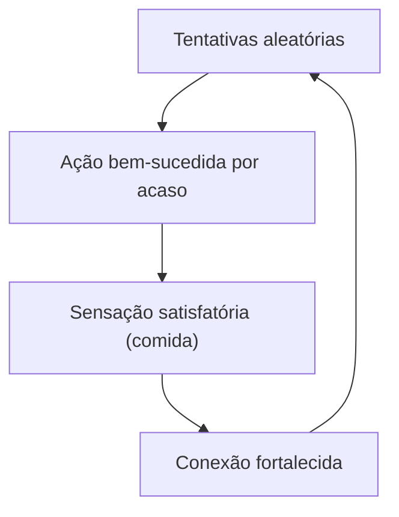

Nas lições anteriores você explorou o **Aprendizado Supervisionado**: um modelo recebe milhares de exemplos acompanhados de gabaritos claros (“isto é uma poção”, “isto é um veneno”) e ajusta seus pesos internos a partir dessa supervisão explícita.

Aqui a nossa jornada muda de família. A pergunta fundamental deixa de ser *“como rotular milhares de dados?”* e passa a ser:

> **Como um agente pode aprender a tomar decisões complexas se ninguém lhe entrega o gabarito a cada segundo, existindo apenas um sinal que indica se a sua vida melhorou ou piorou após uma ação?**

Essa é a essência do **Aprendizado por Reforço** (*Reinforcement Learning* ou **RL**).

---

### 🏛️ Uma origem bem mais antiga que o computador

Muito antes dos computadores modernos existirem, a psicologia experimental já investigava como seres vivos aprendem sem instrução direta.

Em **1898**, o psicólogo norte-americano **Edward Thorndike** colocava gatos famintos dentro de *caixas-problema*. Do lado de fora, havia comida; do lado de dentro, uma alavanca oculta que abria a porta. Ninguém ensinava o gato a pressionar a trava. O animal arranhava, mordia e pulava de forma desordenada até que, por puro acaso, ativava o mecanismo e conseguia sair.

Ao repetir a experiência dezenas de vezes com o mesmo gato, Thorndike observou algo fascinante: o tempo necessário para escapar **despencava dramaticamente**.



Thorndike formalizou essa descoberta na célebre **Lei do Efeito**:

> *"Respostas acompanhadas de consequências satisfatórias para o animal tornam-se mais firmemente conectadas à situação; portanto, quando a situação se repete, é mais provável que essas respostas ocorram novamente."*

Décadas mais tarde, **B. F. Skinner** aprofundou essa linha com o **Condicionamento Operante**: um comportamento é moldado pelas suas consequências (reforços positivos fortalecem a ação, enquanto punições a enfraquecem).

O **Aprendizado por Reforço Computacional** pega essa premissa biológica e a traduz em matemática rigorosa: o algoritmo executa uma ação no ambiente, recebe um sinal numérico (**recompensa** ou **punição**) e atualiza sua estratégia interna. Tentativa, erro e ajuste.

---

### ⚖️ O que o Aprendizado Supervisionado não resolve sozinho

No paradigma supervisionado, cada amostra possui um rótulo perfeito. Porém, em cenários reais como pilotar um drone, jogar xadrez ou controlar um braço robótico, essa abordagem falha por três motivos:

1. **Ausência de Gabarito Passo a Passo:** Ninguém consegue anotar a ação ideal para cada milissegundo de um voo ou de uma partida.
2. **Recompensa Atrasada (*Delayed Reward*):** Uma jogada genial no xadrez pode acontecer no movimento 10, mas a vitória (recompensa) só é confirmada no movimento 50.
3. **Dependência Sequencial:** O estado atual do mundo depende das decisões que o próprio agente tomou no passado.

O RL resolve isso tratando o aprendizado como uma **interação dinâmica e contínua**:

```mermaid
graph LR
    subgraph Interação RL
        A["Agente (cérebro)"] -->|Ação (a)| B["Ambiente (mundo)"]
        B -->|Estado (s)| A
        B -->|Recompensa (r)| A
    end
```

---

### 🎮 Analogia do Jogador

Pense na primeira vez que você jogou um chefe difícil em um videogame:
* Na primeira tentativa, você atacou de frente e morreu em 3 segundos (punição).
* Na segunda, você tentou esquivar para a esquerda e durou 15 segundos (recompensa moderada).
* Na décima tentativa, você descobriu que esquivar para a direita quando o chefe levanta a espada permite um contra-ataque limpo (alta recompensa).

Ninguém te entregou um manual impresso. Você operou em um ciclo puro de **tentativa, consequência e adaptação**. O RL formaliza exatamente esse processo para que máquinas aprendam a resolver problemas complexos com velocidade de supercomputador.

---

### 🧪 Oficina Prática (Painel ao Lado)

No painel, **você é o tutor** (o ambiente): personagem com **bolsa de petiscos**. O agente é o **cão digital**.

Comandos disponíveis: **Sentar**, **Pular**, **Latir**, **Deitar**.

1. Escolha um comando (ex.: “Senta!”).
2. O cão escolhe uma ação segundo as preferências atuais (no início, quase no acaso).
3. Se acertou o comando: **Dar petisco** (reforço positivo).
4. Se errou: **Sem petisco**. Não há botão de “punir” o animal: **reter o prêmio** já é o sinal. O cão fica cabisbaixo; o tutor fica desapontado, sem raiva.
5. Observe as barras de preferência e a **pontuação do tutor** (+1 / 0 / −1 conforme a regra de treino). Pontos negativos medem a qualidade do treino, não “castigo” emocional.

Com petiscos consistentes no comando certo, a preferência da ação sobe. Isso é a **Lei do Efeito** em código.

---

### 💡 O que levar desta lição

* **Supervisionado** = aprender com **rótulos e gabaritos**.
* **Por Reforço (RL)** = aprender com as **consequências da interação**.
* **Reforço positivo** (petisco) fortalece a ação feita; **ausência de reforço** a enfraquece aos poucos (extinção), sem precisar de raiva.
* **Seu papel no painel:** tutor/ambiente que decide se há recompensa.

Na próxima lição, vamos decompor as **cinco peças fundamentais** de qualquer sistema de RL.
<!-- audio-skip-start -->
### 📚 Referências Científicas & Leituras Recomendadas

* **Thorndike, E. L. (1898):** *Animal Intelligence: An Experimental Study of the Associative Processes in Animals*. Psychological Review.
* **Skinner, B. F. (1938):** *The Behavior of Organisms: An Experimental Analysis*. Appleton-Century.
* **Sutton, R. S., & Barto, A. G. (2018):** *Reinforcement Learning: An Introduction* (2ª ed., Cap. 1). MIT Press.
<!-- audio-skip-end -->
