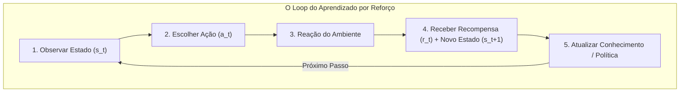

Em **Os 5 Pilares do RL**, você conheceu os cinco componentes essenciais: Agente, Ambiente, Estado, Ação e Recompensa. Agora, é hora de colocá-los em movimento dinâmico.

O Aprendizado por Reforço **não** acontece em uma única decisão estática. Ele ocorre através de um **ciclo contínuo de feedback** que se repete milhares ou milhões de vezes.

---

### 🔄 As 5 Etapas do Ciclo de RL

A cada instante discreto de tempo $t$, o sistema executa rigorosamente estas cinco etapas em sequência:

#### 1. Observar ($s_t$)
O agente lê os dados disponíveis do ambiente no instante $t$ (ex: o robô detecta a distância da parede e o nível de bateria).

#### 2. Escolher ($a_t$)
Com base no seu conhecimento atual (sua **Política**), o agente seleciona a ação que julga ser mais promissora.

#### 3. Reagir
O ambiente recebe a ação $a_t$, processa as regras de física e calcula a transição do mundo.

#### 4. Feedback ($r_t$, $s_{t+1}$)
O ambiente devolve dois sinais vitais para o agente:
- A **Recompensa ($r_t$)**: quão boa ou ruim foi a ação tomada.
- O **Novo Estado ($s_{t+1}$)**: a nova fotografia do mundo após a ação.

#### 5. Atualizar
O agente compara o que esperava com a recompensa real que recebeu e ajusta sua memória interna (seus pesos ou valores na tabela). Na próxima vez que estiver no estado $s_t$, sua escolha será mais inteligente.

---

### ⌛ Episódios e a Noção de Experiência

Uma sequência completa desse ciclo, do início até um ponto final natural, é chamada de **Episódio**.

* Em um jogo de xadrez: um episódio vai da primeira jogada até o *xeque-mate* ou empate.
* Em um robô aprendendo a andar: um episódio vai do momento em que ele fica em pé até o momento em que ele cai no chão.

Cada volta completa no ciclo gera uma unidade fundamental de aprendizado chamada **Quádrupla de Experiência**:

$$\text{Experiência} = (s_t, a_t, r_t, s_{t+1})$$

A inteligência da máquina não surge de uma fórmula pronta digitada por um programador, mas da **acumulação massiva dessas quádruplas de experiência**.

---

### 🧪 Oficina Prática: O Motor do Ciclo (Painel ao Lado)

No painel interativo à direita, você conta com um **Simulador de Ciclo Animado**:

1. **Passo a Passo Guiado:** Clique no botão **1 Micro-Passo ⏭️**. Veja o pulso luminoso avançar exatamente por cada uma das 5 etapas no diagrama circular.
2. **Acompanhe a Transição:** Note como o robô no palco visual executa a ação, a luz do estado acende e a barra da ação escolhida sofre um micro-ajuste na etapa de atualização.
3. **Intervenção Manual:** Experimente clicar em um botão de ação forçada (ex: **Forçar Recuar ⬅️**). Você assumirá temporariamente o controle do agente e verá a reação imediata do ciclo!
4. **Modo Automático:** Ative o botão **Rodar Ciclo ▶️** para assistir ao loop girando continuamente em alta velocidade.

---

### 💡 O que levar desta lição

* RL é um **processo cíclico**: Observar $\to$ Escolher $\to$ Reagir $\to$ Receber Feedback $\to$ Atualizar.
* **Episódio:** o bloco de tempo da partida inicial até o encerramento.
* A cada ciclo, o agente armazena a quádrupla $(s_t, a_t, r_t, s_{t+1})$ para refinar sua tomada de decisão futura.

Na próxima lição, enfrentaremos o maior conflito filosófico e prático do RL: **devo arriscar algo novo ou repetir o que já sei que funciona?**
<!-- audio-skip-start -->
### 📚 Referências Científicas & Leituras Recomendadas

* **Sutton, R. S., & Barto, A. G. (2018):** *Reinforcement Learning: An Introduction* (2ª ed., Cap. 3.1: *The Agent-Environment Interface*). MIT Press.
* **Watkins, C. J. C. H. (1989):** *Learning from Delayed Rewards*. Tese de Doutorado, King's College, Cambridge.
<!-- audio-skip-end -->
