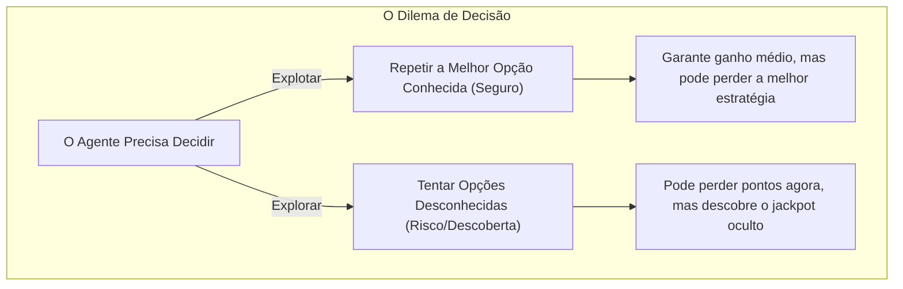

Imagine que você entra em um restaurante que adora e pede o seu prato favorito de sempre. A refeição é excelente, e você sai 100% satisfeito. 

No entanto, há uma dúvida pairando no ar: *e se o novo prato do cardápio, que você nunca provou, for 10 vezes mais delicioso?* Por outro lado, pedir o prato novo é um risco: ele pode ser horrível e estragar o seu jantar.

Esse dilema humano universal reflete o problema fundamental do Aprendizado por Reforço:

> **Devemos agir com base no conhecimento que já temos (Explotar) ou arriscar o desconhecido em busca de algo melhor (Explorar)?**

---

### 🎰 O Problema do Caça-Níveis de Várias Alavancas (*Multi-Armed Bandit*)

Na literatura científica de IA, esse dilema é estudado através de um clássico experimento de pensamento formulado durante a Segunda Guerra Mundial: o **Problema do Caça-Níveis de Várias Alavancas** (*Multi-Armed Bandit Problem*).

Imagine que você está diante de uma fileira com 4 máquinas de cassino (*caça-níqueis*). Cada máquina possui uma probabilidade oculta diferente de pagar um prêmio:

* A Máquina A paga em média **$2.00**.
* A Máquina B paga em média **$8.00** (a melhor, mas você ainda não sabe!).
* A Máquina C paga em média **$0.50**.
* A Máquina D paga em média **$4.00**.

Ao chegar no cassino, todas parecem idênticas. Se você puxar a Máquina D na primeira tentativa e ganhar $4.00, você pode cair na armadilha de **explotar** apenas a Máquina D para sempre. Você obterá um resultado decente, mas **jamais descobrirá que a Máquina B era infinitamente superior**.

---

### ⚖️ Explorar vs. Explotar: A Definição Formal

* **Explotação (*Exploitation*):** Escolher a ação que possui o maior valor estimado no momento. Aproveita ao máximo o conhecimento atual para obter recompensas imediatas.
* **Exploração (*Exploration*):** Escolher ações não-ótimas ou desconhecidas para coletar novas informações sobre o ambiente. Sacrifica recompensa no curto prazo para melhorar as decisões no longo prazo.

#### Por que um agente puro em qualquer um dos extremos falha?
* **Agente 100% Explotador:** Fica preso na primeira solução "razoável" que encontra. Sofre de miopia e nunca descobre atalhos ou estratégias superiores.
* **Agente 100% Explorador:** Age como um gerador de números aleatórios para sempre. Mesmo após descobrir o caminho perfeito, continua cometendo erros infantis por puro impulso de testar o novo.

---

### 📜 A Política ($\pi$) e a Estratégia $\epsilon$-Greedy

A regra que define como o agente balanceia a exploração e a explotação é chamada de **Política** ($\pi$).

Uma das estratégias mais famosas e eficazes em estatística e RL é a **Estratégia $\epsilon$-Greedy** (Épsilon-Gulosa):

1. Com probabilidade $1 - \epsilon$ (ex: $90\%$), o agente **explota** (escolhe a melhor ação aprendida).
2. Com probabilidade $\epsilon$ (ex: $10\%$), o agente **explora** (escolhe uma ação aleatória qualquer).

$$a_t = \begin{cases} \arg\max_a Q(s, a) & \text{com probabilidade } 1 - \epsilon \text{ (Explotar)} \\ \text{ação aleatória} & \text{com probabilidade } \epsilon \text{ (Explorar)} \end{cases}$$

Além disso, é comum praticar o **Decaimento de Épsilon**: no início do treinamento, definimos $\epsilon = 1.0$ ($100\%$ de exploração, pois o agente é ignorante). Conforme o agente aprende, reduzimos o $\epsilon$ gradualmente até $0.05$, permitindo que ele consolide seu domínio sobre o ambiente.

---

### 🧪 Oficina Prática: O Cassino do Agente (Painel ao Lado)

No painel interativo à direita, você vai testar o dilema na prática em um simulador de caça-níqueis:

1. **Alavancas Ocultas:** Existem 4 alavancas com taxas de recompensa desconhecidas.
2. **Explore vs. Explote:**
   * Clique manualmente nas alavancas para testar hipóteses.
   * Ajuste o slider de **Taxa de Exploração ($\epsilon$)** de $0\%$ a $100\%$.
3. **Simule o Agente:** Ative a simulação automática e observe o gráfico de recompensa média acumulada:
   * Em $\epsilon = 0\%$ (Pura Explotação), veja o agente viciar na primeira alavanca boa que encontrar.
   * Em $\epsilon = 100\%$ (Pura Exploração), veja o agente ganhar poucos pontos por ser aleatório.
   * Em $\epsilon = 15\%$ (Equilíbrio), veja o agente descobrir o jackpot da Máquina B e acumular o maior retorno possível!

---

### 💡 O que levar desta lição

* **Explotar** = usar o que já sabe (curto prazo). **Explorar** = buscar o desconhecido (longo prazo).
* Nenhum sistema inteligente funciona sem o equilíbrio adequado entre explorar e explotar.
* **Política ($\pi$):** a função ou estratégia que dita a escolha da ação em cada estado.
* A estratégia **$\epsilon$-greedy** garante que a IA continue descobrindo o mundo mesmo quando já possui uma boa estratégia em mãos.

Você agora domina todos os conceitos fundamentais da Fase 1! Na próxima fase, aplicaremos esses pilares na prática construindo o algoritmo **Q-Learning** do zero!
<!-- audio-skip-start -->
### 📚 Referências Científicas & Leituras Recomendadas

* **Sutton, R. S., & Barto, A. G. (2018):** *Reinforcement Learning: An Introduction* (2ª ed., Cap. 2: *Multi-armed Bandits*). MIT Press.
* **Robbins, H. (1952):** *Some aspects of the sequential design of experiments*. Bulletin of the American Mathematical Society, 58(5), 527-535.
<!-- audio-skip-end -->
